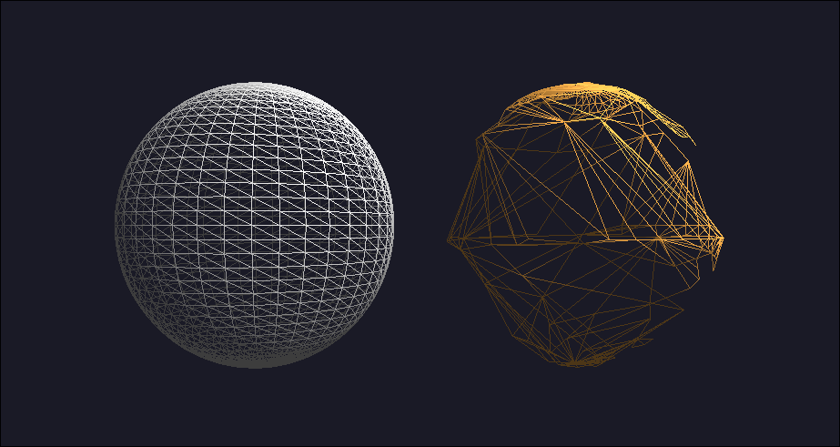

# 3D Graphics - OpenGL Framework and CHE Implementation


This repository contains the assignments and a custom OpenGL framework developed for the 3D Graphics course. It demonstrates fundamental computer graphics concepts, including the implementation of the Compact Half-Edge (CHE) topological data structure for efficient mesh representation.

---

## Project Structure

* `include/`: Contains the core framework wrappers (`Window`, `Shader`, `VAO`, `VBO`, `EBO`) and the data structure `EricStructure.h` (CHE).
* `src/`: Contains the specific implementation for each assignment.
  * `Simplificacion/`: **(Current Exercise - Task 04)** Level of Detail (LOD) using Quadric Error Metrics (QEM) and Edge Collapse on a CHE.
  * `Transformaciones/`: Implementation of MVP matrices (GLM), featuring a rotating cube, an orbiting sphere, and 4-point real-time diffuse lighting.
  * `SphereCHE/`: Implementation of the Compact Half-Edge structure for rendering parametric spheres and cubes.
  * `Sierpinski/`: 2D fractal rendering algorithms (Chaos Game and Recursive).
  * `HelloTriangle/`: Basic OpenGL setup and rendering pipeline test.

---

## 🎥 Current Exercise Demo: Mesh Simplification (QEM LOD)

This module implements the Garland-Heckbert Quadric Error Metrics algorithm for mesh decimation. It performs edge collapses directly on the Level 1 Compact Half-Edge (CHE) structure while maintaining topological integrity via lazy updates.



*Final Triangle Count: 500 | Average Error (Distance to original r=1 surface): 0.0026*

---

## Build and Execution Instructions

The project uses CMake to generate the build files, but a Makefile is provided in the root directory for convenience.

### 1. Build the Project
To configure CMake and build all executable targets, run the following command in the root directory:

```bash
make all
```

### 2. Run the Applications
After building, you can execute any of the generated targets using the corresponding make command:

**Current Assignment (Transformations & MVP):**
```bash
make run-Transformaciones
```

**CHE Data Structure:**
```bash
make run-SphereCHE
```

**Previous Assignments:**
```bash
make run-HelloTriangle
make run-ChaosAlgorithm
make run-RecursiveAlgorithm
```

---

## Application Controls (SphereCHE)

When running `make run-SphereCHE`, use the following keyboard controls to interact with the application:

**Geometry Selection:**
* `C` : Load Cube mesh
* `V` : Load Parametric Sphere mesh

**Rendering Modes:**
* `1` : Point Cloud (`GL_POINTS`)
* `2` : Wireframe / Mesh (`GL_LINE`)
* `3` : Solid with diffuse lighting (`GL_FILL`)

**Lighting Controls:**
* `W` / `S` : Move light along the Y axis (Up/Down)
* `A` / `D` : Move light along the X axis (Left/Right)
* `Q` / `E` : Move light along the Z axis (Forward/Backward)
