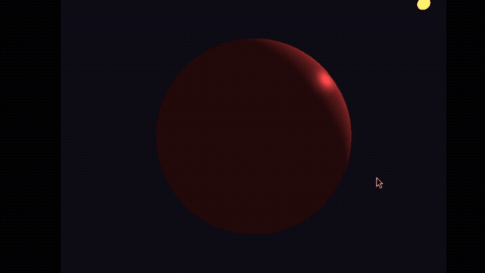
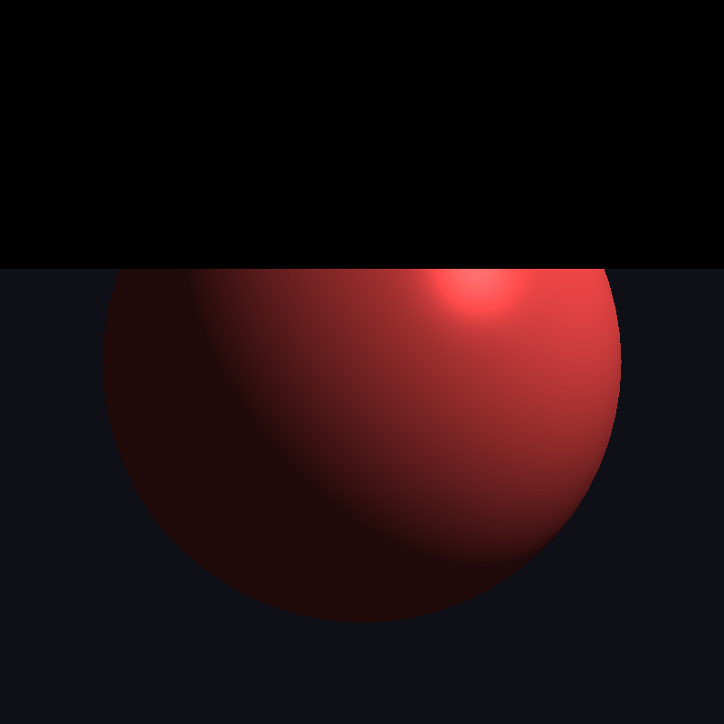

# Modelos de Iluminación y Shading (Task 09 - Computer Graphics UTEC)

Implementación interactiva y comparativa entre los **Modelos de Reflexión** (Phong vs. Blinn-Phong) y las **Técnicas de Interpolación de Sombreado** (Gouraud Shading vs. Phong Shading).

---

## 1. Fundamentos Teóricos

### 1.1 Modelos de Reflexión (Reflection Models)
Ambos modelos descomponen la luz reflejada en tres componentes fundamentales:
$$I = I_{\text{ambient}} + I_{\text{diffuse}} + I_{\text{specular}}$$

1. **Componente Ambiental ($I_{\text{ambient}}$):**
   Aproxima la iluminación indirecta global uniforme:
   $$I_{\text{ambient}} = k_a I_a$$

2. **Componente Difusa ($I_{\text{diffuse}}$ - Reflexión Lambertiana):**
   Depende del ángulo entre la normal de la superficie $\vec{N}$ y el vector hacia la luz $\vec{L}$:
   $$I_{\text{diffuse}} = k_d I_d \max(0, \, \vec{N} \cdot \vec{L})$$

3. **Componente Especular ($I_{\text{specular}}$):**
   * **Modelo de Phong Clásico:**
     Calcula el brillo especular basándose en el alineamiento entre el vector de reflexión $\vec{R}$ y el vector de visión $\vec{V}$:
     $$\vec{R} = 2(\vec{N} \cdot \vec{L})\vec{N} - \vec{L}$$
     $$I_{\text{specular}} = k_s I_s \max(0, \, \vec{R} \cdot \vec{V})^\alpha$$
     *Donde $\alpha$ es el exponente de brillo (shininess).*

   * **Modelo de Blinn-Phong:**
     Optimiza el cálculo especular introduciendo el **vector medio** (*halfway vector*) $\vec{H}$, eliminando el costoso cálculo de reflexión:
     $$\vec{H} = \frac{\vec{L} + \vec{V}}{\|\vec{L} + \vec{V}\|}$$
     $$I_{\text{specular}} = k_s I_s \max(0, \, \vec{N} \cdot \vec{H})^\beta$$
     *Nota: Para lograr brillos equivalentes a Phong, se suele usar $\beta \approx 2\alpha$ a $4\alpha$.*

---

### 1.2 Técnicas de Interpolación de Sombreado (Shading Techniques)

| Característica | Gouraud Shading | Phong Shading |
| :--- | :--- | :--- |
| **Dónde se evalúa la luz** | **Vertex Shader** (por cada vértice) | **Fragment Shader** (por cada píxel) |
| **Qué se interpola en el rasterizador** | El **Color resultante** ($\vec{I}$) | La **Normal** ($\vec{N}$) y la **Posición** ($\vec{P}$) |
| **Costo Computacional** | Muy bajo (escalable con vértices) | Mayor (escalable con píxeles/resolución) |
| **Calidad Especular** | Deficiente: si el brillo cae dentro de la cara, se pierde o distorsiona; sufre de artefactos de *Mach Banding*. | Alta calidad: reflejos circulares nítidos y continuos en toda la superficie. |

---

## 2. Implementación en Shaders

El proyecto implementa dos programas de shaders completos:
1. **Gouraud Pipeline (`gouraud.vert` / `gouraud.frag`):**
   - El Vertex Shader calcula la ecuación completa (Ambient + Diffuse + Specular ya sea Phong o Blinn-Phong).
   - El Fragment Shader recibe `in vec3 LightingColor` y simplemente modula el color del objeto.
2. **Phong Pipeline (`phong.vert` / `phong.frag`):**
   - El Vertex Shader transforma y envía `FragPos` y `Normal` al rasterizador.
   - El Fragment Shader normaliza los vectores interpolados y calcula la ecuación de iluminación por fragmento.

---

## 3. Demostración Visual



*Grabación interactiva mostrando la alternancia en vivo entre Gouraud Shading y Phong Shading, el modelo Phong clásico vs. Blinn-Phong, el ajuste dinámico de la fuente de luz y del exponente especular, y la navegación con la cámara Arcball.*



---

## 4. Controles Interactivos de la Aplicación

| Tecla / Entrada | Acción |
| :--- | :--- |
| **`1` o `G`** | Alternar entre **Gouraud Shading** (Por Vértice) y **Phong Shading** (Por Fragmento) |
| **`2` o `B`** | Alternar entre el modelo **Phong** ($\vec{R} \cdot \vec{V}$) y **Blinn-Phong** ($\vec{N} \cdot \vec{H}$) |
| **`O`** | Alternar modelo 3D (Esfera $\rightarrow$ Toroide $\rightarrow$ Cubo) |
| **`L`** | Pausar / Reanudar la órbita de la fuente de luz |
| **`FLECHA ARRIBA`** | Duplicar el exponente de brillo ($\alpha \times 2$) |
| **`FLECHA ABAJO`** | Reducir el exponente de brillo a la mitad ($\alpha / 2$) |
| **Clic Izq + Arrastrar** | Rotación Arcball 3D con Cuaterniones |
| **Scroll del Ratón** | Zoom In / Zoom Out |
| **Clic Der + Arrastrar** | Paneo de cámara |
| **`R`** | Reiniciar cámara a la vista inicial |
| **`ESC`** | Salir |

---

## 5. Compilación y Ejecución

Compilar y ejecutar directamente desde la raíz del proyecto:
```bash
make run-Iluminacion
```
O usando CMake:
```bash
cmake -B build
cmake --build build --target Iluminacion
./build/Iluminacion
```
